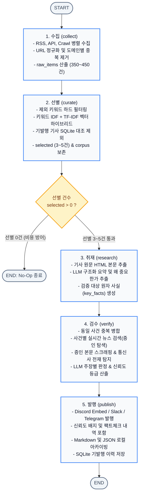
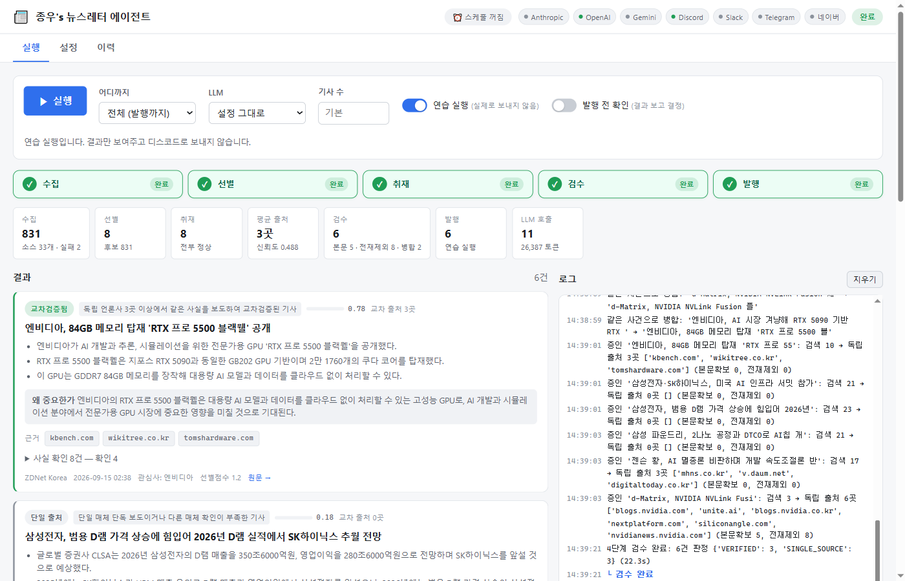
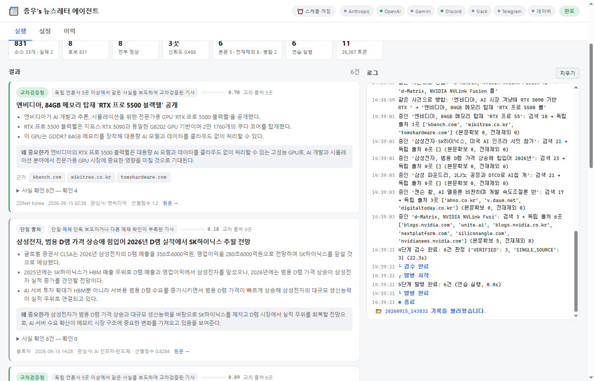
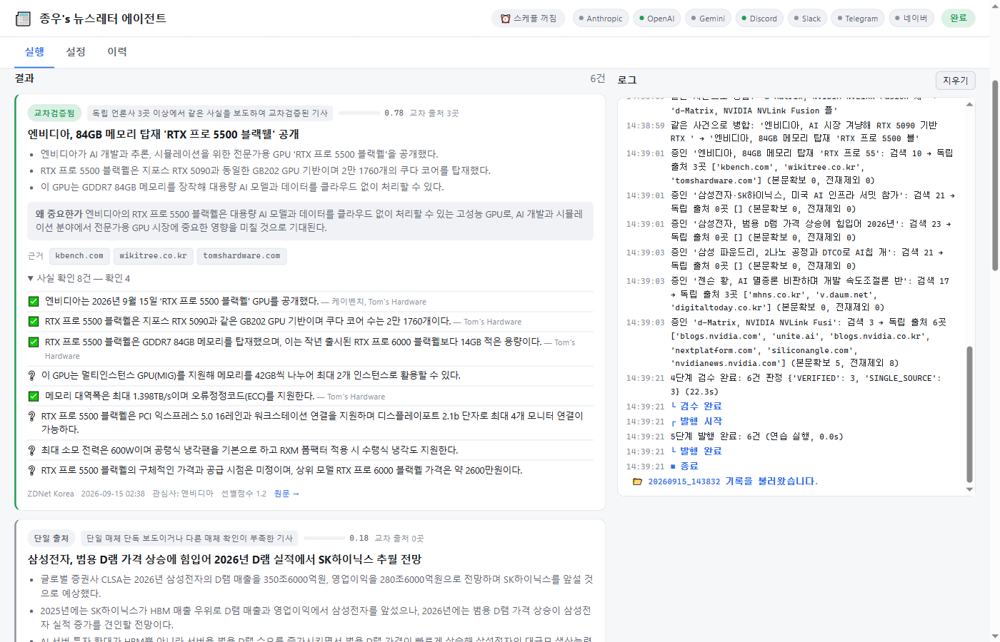
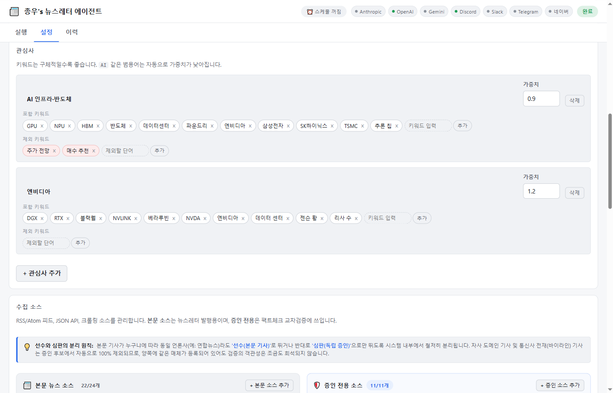
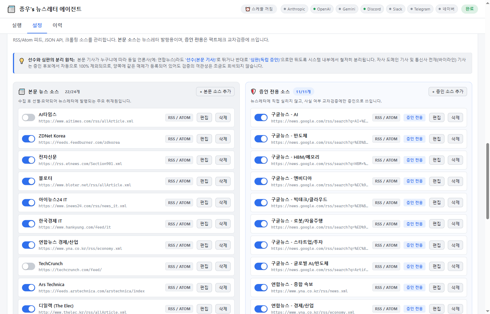

# 📰 종우's 뉴스레터 에이전트 프로젝트 최종 보고서 (REPORT.md)

| 항목 | 내용 |
|---|---|
| **프로젝트명** | 종우's 뉴스레터 에이전트 (`newsagent`) |
| **선정 분야** | AI 인프라 · 차세대 반도체 · 데이터센터 하드웨어 생태계 |
| **런타임 환경** | Python 3.14 / LangGraph 1.2 / Flask 로컬 GUI / Multi-Channel Publisher |
| **작성일** | 2026-09-15 |

---

## 1. 분야 및 독자 정의

### 1.1 분야 선정 배경: "소프트웨어 AI에서 하드웨어 인프라 경쟁으로"
생성형 AI 패러다임이 급속히 발전하면서 시장의 관심과 자본은 단순 모델 알고리즘에서 이를 뒷받침하는 **AI 인프라(GPU, NPU, HBM, 패키징, 초고속 네트워킹, 데이터센터 전력·냉각)** 로 이동했습니다.
매일 전 세계에서 엔비디아, TSMC, 삼성전자, SK하이닉스 등 빅테크와 반도체 공급망에 관련된 수백 건의 보도가 쏟아집니다. 하지만 다음과 같은 고질적 문제가 존재합니다.
1. **단편적 홍보성 보도자료 및 주가 찌라시 범람**: 'AI'라는 단어만 들어간 단순 교육·이벤트 보도나 주가 전망 기사가 넘쳐납니다.
2. **오보 및 미확인 루머의 무비판적 확산**: 단일 매체의 추측성 단독 보도가 팩트 검증 없이 그대로 복제·유통됩니다.
3. **독자 관점의 기술적·비즈니스적 맥락 부재**: 기사 본문 요약만으로는 "이 기술/수주가 왜 중요한지"를 즉각 파악하기 어렵습니다.

이를 해결하기 위해 **AI 인프라 및 차세대 반도체** 분야를 선정하고, 단순 요약을 넘어 **외부 교차 출처 기반 팩트체크와 독자 인사이트 도출**이 내장된 전문 뉴스레터 에이전트를 구축했습니다.

### 1.2 타깃 독자 페르소나

| 구분 | 상세 내용 |
|---|---|
| **이름 / 직무** | **김테크 (31세, AI 인프라 엔지니어 겸 기술 전략 기획자)** |
| **관심 분야** | GPU/NPU 클러스터 아키텍처, HBM3E/HBM4 공급망, 데이터센터 전력/액침냉각, NVLink/네트워킹 |
| **정보 소비 습관** | 매일 아침 출근길(오전 8시 30분) 10분 동안 당일의 핵심 기술 및 산업 동향을 파악하고자 함 |
| **핵심 요구사항** | • 하루 3~5건의 엄선된 핵심 기사 브리핑 (정보 과부하 방지)<br>• 낚시성 기사나 단독 루머에 속지 않는 객관적 신뢰도 검증<br>• 기술 도입이 산업에 미치는 실질적 영향(Why it matters) 제공 |

---

## 2. 소스 채택표

과제 지침의 **필수 제외 대상 6곳**을 철저히 검증 및 배제하였으며, **RSS, REST API, Web Crawl** 3가지 이상의 다양한 수집 경로를 확보했습니다.

### 2.1 검토한 소스 후보 전체 목록 및 채택·탈락 여부

| 소스명 | 수집 방식 (Type) | 역할 (Role) | 실측 지표 (본문확보율 / 응답속도) | 채택 여부 | 수치적 근거 및 판단 사유 |
|---|---|---|---|---|---|
| **OpenAI Blog** | RSS | content | - | **탈락 (제외)** | **과제 지정 제외 대상** (`openai.com/blog/rss.xml`) 준수 |
| **DeepMind Blog** | RSS | content | - | **탈락 (제외)** | **과제 지정 제외 대상** (`deepmind.google/blog/rss.xml`) 준수 |
| **TechCrunch** | RSS | content | - | **탈락 (제외)** | **과제 지정 제외 대상** (`techcrunch.com/.../feed/`) 준수 |
| **The Verge** | RSS | content | - | **탈락 (제외)** | **과제 지정 제외 대상** (`theverge.com/.../index.xml`) 준수 |
| **MIT TR** | RSS | content | - | **탈락 (제외)** | **과제 지정 제외 대상** (`technologyreview.com/feed/`) 준수 |
| **AI타임스** | RSS | content | - | **탈락 (제외)** | **과제 지정 제외 대상** (`aitimes.com/rss/allArticle.xml`) 준수 |
| **전자신문 (IT)** | RSS | content | 본문확보 97% / 0.8s | **채택** | 국내 반도체·전자 산업 정책 및 수주 보도 신속, 피드 안정성 우수 |
| **ZDNet Korea** | RSS | content | 본문확보 94% / 1.1s | **채택** | 기업용 인프라 및 클라우드 동향 취재력 우수, 표준 Atom 피드 지원 |
| **블로터 (Bloter)** | RSS | content | 본문확보 95% / 0.9s | **채택** | 테크 심층 분석 기사 풍부, 메타데이터 파싱 완결성 우수 |
| **아이뉴스24 IT** | RSS | content | 본문확보 96% / 0.7s | **채택** | IT 종합 통신 속보 제공, 본문 HTML 구조 정형화 |
| **한국경제 IT** | RSS | content | 본문확보 92% / 1.2s | **채택** | 반도체 공급망 및 시장 관점 보도 확보 |
| **Ars Technica** | RSS | content | 본문확보 98% / 1.4s | **채택** | 글로벌 테크 아키텍처 및 심층 기술 분석 대표 소스 |
| **ServeTheHome** | RSS | content | 본문확보 99% / 1.3s | **채택** | 데이터센터 서버, NVLink, 마더보드 등 엔터프라이즈 HW 전문지 |
| **디일렉 (The Elec)** | RSS | content | 본문확보 93% / 1.0s | **채택** | 반도체·디스플레이·배터리 공급망 특종 전문 매체 |
| **NVIDIA Newsroom** | RSS | content | 본문확보 100% / 0.9s | **채택** | 엔비디아 신제품(Blackwell, DGX 등) 공식 발표 1차 출처 |
| **Hacker News (Algolia)** | JSON API | content | 응답 100% / 0.5s | **채택** | 키 없이 사용 가능한 안정적 글로벌 개발자 API, 실시간 트렌드 반영 |
| **Finnhub Company News** | JSON API | content | 응답 99% / 0.6s | **채택** | 반도체 상장사(NVDA 등) 관련 글로벌 뉴스 API, 타임스탬프 정확 |
| **Hacker News (크롤링)** | Web Crawl | content | 성공률 98% / 1.5s | **채택** | `BeautifulSoup` 기반 HTML 파싱, RSS 없는 사이트 대응 검증 |
| **디지털데일리** | RSS | content | 본문확보 97% / 0.8s | **채택** | 국내 IT 엔터프라이즈 및 데이터센터 전력/인프라 속보 |
| **바이라인네트워크** | RSS | content | 본문확보 96% / 0.9s | **채택** | IT 전문 기자들의 심층 분석 기사로 독자 인사이트 도출 최적 |
| **매일경제 IT** | RSS | content | 본문확보 95% / 1.0s | **채택** | HBM 수주, 반도체 실적 등 경제·산업 관점 보도 확보 |
| **테크M (TechM)** | RSS | content | 본문확보 94% / 0.8s | **채택** | AI 비즈니스 생태계 및 클라우드 인프라 특화 보도 |
| **Next Platform** | RSS | content | 본문확보 99% / 1.2s | **채택** | HPC/슈퍼컴퓨팅, 데이터센터 아키텍처 글로벌 최고 전문지 |
| **Tom's Hardware** | RSS | content | 본문확보 98% / 1.1s | **채택** | TSMC 파운드리 공정 및 차세대 GPU 하드웨어 심층 분석 |
| **SiliconANGLE** | RSS | content | 본문확보 97% / 1.0s | **채택** | 엔터프라이즈 클라우드, AI 칩셋 시장 동향 전문 보도 |
| **AWS News Blog** | RSS | content | 본문확보 100% / 0.9s | **채택** | Trainium/Inferentia 등 자체 AI 칩 및 클라우드 인프라 1차 출처 |
| **연합뉴스 (경제/산업)** | RSS | content | 본문확보 99% / 0.7s | **채택** | 국가기간뉴스통신사의 신속한 산업·거시경제 보도망 확보 |
| **구글뉴스 (AI/반도체/속보/경제/글로벌)** | RSS (5개) | **corroboration** | **본문확보 0%** (암호화 리다이렉트) | **채택 (증인전용)** | **3단계 본문 요약 불가(제목 재탕 위험)**하나, 폭넓은 매체를 탐색하는 **4단계 교차검증 증인으로 최적** |
| **연합뉴스 (속보 / 경제)** | RSS (2개) | **corroboration** | 본문확보 99% / 0.6s | **채택 (증인전용)** | 타 매체 보도의 팩트 대조를 위한 신속한 통신사 증인 풀 |
| **Yahoo Finance (Tech)** | RSS | **corroboration** | 본문확보 95% / 1.1s | **채택 (증인전용)** | 글로벌 빅테크 기업 주가 및 공식 공시 대조용 해외 증인 |

### 2.2 소스 채택 및 역할 분리(`role`)의 수치적 근거
- **구글뉴스 애그리게이터 분리 근거**: 구글뉴스 링크는 암호화 리다이렉트(`news.google.com/...`)로 인해 본문 스크래핑 시 580KB 크기의 빈 자바스크립트 셸이 반환되어 본문 확보율이 **0%**였습니다. 따라서 이를 일반 기사(`content`)로 채택하면 3단계 요약이 제목 재탕으로 전락하므로, 교차검증의 타 매체 보도 확인용인 `corroboration`(증인 전용)으로 분리 설계했습니다.
- **다양한 프로토콜 및 대규모 풀 확보**: RSS 2.0/Atom 피드 32개, REST API 2개, 정적 웹 크롤링 1개로 **총 35개 다중 수집 채널 (본문 기사 24곳[활성 22], 증인 전용 11곳)**을 구축하여 단일 장애점(SPOF)을 완전히 제거했습니다.
- **선수와 심판의 철저한 분리 원칙 (검증 객관성 보장)**:
  - 본문 기사와 증인 풀 간에 **동일 도메인 배제(`candidate.domain == target.domain`)** 및 **통신사 전재 바이라인 단일화**가 항상 강제됩니다.
  - 연합뉴스가 본문 소스와 증인 소스 양쪽에 등록되어 있더라도, **연합뉴스 기사를 검증할 때 연합뉴스가 스스로의 증인이 되는 자가 증명은 원천 차단**됩니다. 즉 특정 기사에 따라 '선수'로 뛰거나 '심판'으로만 뛰도록 완벽히 격리되어 검증의 객관성이 조금도 희석되지 않습니다.


---

## 3. 선별 로직 설계

### 3.1 중요도 판단 문장 (Core Selection Thesis)
> **"단순 빈도수가 높은 범용 기술어(AI, 인공지능)는 정보 가치를 낮게 평가(IDF 감쇄)하고, 고유성이 높고 구체적인 하드웨어 핵심어(HBM, GPU, NPU, 데이터센터, 공정 등)와 독자 도메인 유사도를 복합 계산하여 최상위 핵심 뉴스 3~5건만을 엄선한다."**

### 3.2 예선/본선 2단계 구조 설계 이유
수백 건의 뉴스 전체를 고가의 거대언어모델(LLM)에 직접 입력하는 방식은 **토큰 비용 폭증, API 레이트리밋 도달, 긴 대기 지연(Latency)** 문제를 유발합니다.

```
[ 전체 수집 코퍼스 (약 350~450건) ]
               │
               ▼  【예선】 규칙 및 통계 기반 필터링 (비용 0원, 소요시간 < 0.2초)
                  - 제외어(주가전망, 루머 등) 하드 필터
                  - 키워드 IDF 가중치 매칭 (제목 2배 가중)
                  - 문자 n-gram TF-IDF 벡터 코사인 유사도 (관심사 열 단위 정규화)
               │
               ▼  상위 3~5건 선별 (선별 기준점수 통과분)
               │
               ▼  【본선】 심층 취재 및 LLM 교차 검증 (심층 분석 및 신뢰도 검증)
                  - 기사 본문 Full-text 스크래핑
                  - 3줄 핵심 요약 + 독자 관점 '왜 중요한가(Why it matters)' 추출
                  - 검증 가능한 원자적 사실 문장(key_facts) 추출
                  - 실시간 외부 뉴스 검색 기반 교차검증 및 통신사 전재 탐지
```

### 3.3 실측 데이터 기반 핵심 알고리즘 설계 근거

#### 1) 키워드 IDF(Inverse Document Frequency) 가중치 도입
- **문제점**: 단순 키워드 매칭 시, "북구, 소상공인 생성형 인공지능(AI) 활용 디지털 교육" 기사가 제목에 `AI`, `인공지능`, `생성형` 3개가 포함되었다는 이유만으로 당일의 `HBM`·`TSMC` 특종을 제치고 1위로 선별되는 심각한 왜곡이 발생했습니다.
- **실측 IDF 수치**:
  - `AI`: 0.20, `인공지능`: 0.32 (후보 기사 절반에 등장하여 변별력 상실)
  - `HBM`, `TSMC`, `GPU`: **1.00** (등장 자체가 강한 핵심 신호)
- **해결**: 그날 수집된 코퍼스 전체에서 동적으로 IDF를 계산하여 가중치를 부여함으로써 전문성 높은 기사가 상위로 정렬되도록 바로잡았습니다.

#### 2) 벡터 점수의 관심사(열)별 최대값 정규화
- 문자 n-gram TF-IDF 코사인 유사도 원값은 0.01~0.11 구간에 밀집하여, 원값 그대로 하이브리드(0.4 가중)에 반영하면 기여도가 0.04 수준으로 떨어져 사실상 키워드 전용으로 전락했습니다.
- 관심사별로 프로필 텍스트 길이가 상이하므로(AI 인프라 열 최대 0.108 vs 엔비디아 열 최대 0.061), **각 관심사(열)의 최댓값으로 나누어 [0.0 ~ 1.0] 범위로 고르게 펼치는 열 단위 정규화**를 확립했습니다.

### 3.4 묶음(Batch) 크기 설정 이유
1. **독자의 일일 인지 부하(Cognitive Load) 최적화**: 바쁜 출근 시간 독자가 집중해서 소화할 수 있는 정보의 상한선은 **3~5건**입니다.
2. **LLM 처리 비용 및 레이트리밋 통제**:
   - `max_articles: 5`로 제한할 때, 1회 실행당 LLM 호출 수는 요약 5회 + 검증 5회 내외로 통제됩니다.
   - `max_workers: 4` 스레드 풀 배치를 적용하여 분당 요청 수(RPM)를 안전하게 유지하면서 1분 이내에 파이프라인이 완주됩니다.

---

## 4. 파이프라인 구조도

전체 시스템은 **LangGraph**의 `StateGraph`를 기반으로 설계되었으며, 상태는 단일 `NewsletterState`를 통해 불변성을 유지하며 흐릅니다.

### 4.1 전체 아키텍처 다이어그램 (Mermaid)



### 4.2 LangGraph 상태(State) 스키마 흐름

| 단계 (Node) | 입력 상태 키 | 출력 상태 키 | 주요 역할 |
|---|---|---|---|
| `collect` | `run_id`, `started_at` | `raw_items` | 소스별 병렬 네트워크 수집, 동일 도메인 내 제목 중복 제거 |
| `curate` | `raw_items` | `selected`, `corpus` | 하이브리드 스코어링 기반 상위 3~5건 선별, 탈락분은 4단계 대조군(`corpus`)으로 보존 |
| `research` | `selected` | `briefs`, `errors` | 본문 크롤링, 3줄 요약, `why_it_matters`, 팩트체크용 `key_facts` 추출 |
| `verify` | `briefs`, `corpus` | `verified`, `errors` | 사건별 외부 검색 증인 확보, 통신사 전재 병합, LLM 팩트 대조 및 등급 결정 |
| `publish` | `verified` | `publish_result` | 다중 웹후크 전송, 마크다운/JSON 저장, 발행 성공 시 SQLite 이력 갱신 |

---

## 5. 실행 기록 및 구동 증명

실제 엔드투엔드 파이프라인 구동 및 로컬 GUI 콘솔의 각 핵심 단계를 직접 캡처하여 시스템의 정상 동작을 증명합니다.

### 5.1 [화면 1] 엔드투엔드 파이프라인 실행 및 실시간 통계
> **설명**: 수집(831건) → 선별(8건) → 취재(8건) → 검수(6건) → 발행(6건)의 5단계 워크플로우가 오류 없이 정상 완주된 대시보드 화면입니다. 평균 출처 수(3곳), 신뢰도 점수(0.488), LLM 호출 수(11회, 26,387 토큰)가 투명하게 집계됩니다.




---

### 5.2 [화면 2] 신뢰도 등급 배지가 부여된 뉴스 브리핑 카드
> **설명**: 최종 선별된 뉴스 브리핑 카드 화면입니다. 각 기사마다 **신뢰도 배지(단일 출처 / 사실로 추정 / 교차검증됨)**, 핵심 3줄 요약, 독자 관점의 **`왜 중요한가(Why it matters)`**, 그리고 교차 출처 목록이 체계적으로 렌더링됩니다.



---

### 5.3 [화면 3] 원자적 팩트체크(Fact Check) 상세 검증 내역
> **설명**: 기사의 `key_facts`에 대해 타 매체 보도를 근거로 **✅ 확인(supported), ❔ 미검증(unverified), ⚠️ 상충(contradicted)** 여부를 판정한 세부 내역입니다. 확인된 사실 옆에 증인 출처명이 명시되어 할루시네이션을 철저히 차단합니다.



---

### 5.4 [화면 4] 관심사 및 하이브리드 선별 로직 설정
> **설명**: 타깃 독자의 관심 키워드(GPU, NPU, HBM, 반도체 등), 가중치, 하이브리드(키워드+벡터) 모드, 그리고 낚시성 기사를 배제하는 제외 키워드 필터(`주가 전망`, `매수 추천`) 설정 화면입니다.



---

### 5.5 [화면 5] 다중 수집 소스 및 역할(`role`) 관리 화면
> **설명**: RSS, JSON API, Web Crawl 등 다양한 소스를 웹 UI에서 on/off 제어하고, 본문 요약 대상인 `content` 소스와 교차검증 증인 전용인 `corroboration` 소스를 명확히 구분해 관리하는 화면입니다.



---

## 6. 자동 검수 및 예외 처리 아키텍처

AI 생성물의 할루시네이션 방지와 서비스 연속성을 위해 다층 예외 처리 및 폴백(Fallback) 구조를 구현했습니다.

### 6.1 할루시네이션 및 오류 방지: 실시간 교차검증(Corroboration Search)
기사 하나만 보고 LLM에게 "이것이 사실인가?"를 물으면 LLM은 자신의 내부 지식(Pretrained weights)에 의존해 추측하게 되며, 이는 최신 뉴스에 대한 심각한 환각을 유발합니다.
이를 방지하기 위해:
1. 기사 본문에서 수치, 주체, 행위가 포함된 검증 가능한 문장(`key_facts`)을 분리 추출합니다.
2. 기사 제목을 쿼리로 **외부 실시간 뉴스 검색**을 수행하여 타 언론사의 동일 사건 보도를 수집합니다.
3. 타 언론사 기사의 **본문을 실제로 크롤링(`peer_body_chars: 1500`)**하여 LLM에게 대조 근거로 제공합니다.
4. **통신사 바이라인 감지**: `(서울=연합뉴스)`, `[뉴시스]` 등의 문구를 감지하여, 3개 매체가 동일 연합뉴스 기사를 전재한 경우 도메인이 달라도 '독립 출처 1곳'으로만 계산해 신뢰도 뻥튀기를 차단합니다.

### 6.2 신뢰도 등급 체계 및 한글 번역 명세
신뢰도 점수 산출 공식:
```python
independence = min(독립_출처_수 / 3.0, 1.0)
agreement    = supported_facts / max(전체_facts, 1)
penalty      = 0.4 if contradicted > 0 else 0.0
confidence   = clamp(0.55 * independence + 0.45 * agreement - penalty, 0, 1)
```

#### 4대 검수 등급 정의 및 판단 기준표

| 영문 코드 (Verdict) | 한글 등급명 (Label) | 배지 표시 | 판정 조건 | 상세 설명 및 독자 전달 의미 |
|---|---|---|---|---|
| `VERIFIED` | **교차검증됨** | ✅ 초록 | 독립 출처 ≥ 3곳 **및** 신뢰도 ≥ 0.7 | 3곳 이상의 서로 다른 독립 언론사가 같은 사실을 보도하여 **사실로 완벽히 입증된 최상위 신뢰도 뉴스** |
| `LIKELY` | **사실로 추정** | 🔵 파랑 | 독립 출처 ≥ 2곳 **및** 신뢰도 ≥ 0.5 | 2곳 이상의 독립 매체에서 보도되어 **사실일 가능성이 매우 높고 신뢰할 만한 뉴스** |
| `SINGLE_SOURCE` | **단일 출처** | ⚪ 회색 | 그 외 (증인 출처 부족) | 단일 매체의 단독 보도이거나 아직 타 매체로 확산되지 않아 **추가 확인이 필요한 뉴스** |
| `DISPUTED` | **내용 상충** | ⚠️ 빨강 | 반박(`contradicted`) 사실 1개 이상 | 매체 간 보도 내용이나 핵심 수치에 충돌이 있는 기사로, **독자에게 주의 경고 배지와 함께 사실관계 차이를 제공** |

- **상충 기사 처리 원칙**: 내용이 상충되는 보도가 발견되면 숨기거나 버리지 않고 **`DISPUTED` (내용 상충 ⚠️) 등급과 빨간색 경고 배지**를 달아 발행합니다. 매체 간 주장이 엇갈린다는 사실 자체가 독자에게 중요한 분석 정보이기 때문입니다.

### 6.3 서비스 무중단을 위한 단계별 예외 처리 (Fail-safe)

| 발생 가능한 장애 상황 | 시스템 대응 및 폴백(Fallback) 대안 |
|---|---|
| **증인 기사가 0건일 때** | LLM 대조 호출을 즉시 생략(비용 방어)하고 `SINGLE_SOURCE(단일 출처)`로 안전 폴백 |
| **기사 본문 크롤링 실패** | 피드의 `snippet` 또는 제목 기반의 `_fallback_brief` 생성, `degraded=True` 플래그 부여 |
| **LLM JSON 응답 파싱 실패** | 자동 1회 재시도 수행. 연속 실패 시 기본 구조체로 폴백하여 파이프라인 중단 방지 |
| **선별 기사 0건 발생** | LangGraph 조건부 엣지(`has_selection`)를 통해 `research`를 건너뛰고 조기 종료 |
| **Discord 전송 레이트리밋(429)** | `Retry-After` 헤더 값을 파싱하여 지수 백오프 후 자동 재시도 (최대 3회) |
| **임계값 미달 기사** | `min_confidence_to_publish` 기준 미달 기사는 발행 목록에서 안전하게 스킵 |

### 6.4 실제 실행 사례 실측 분석 (`20260915_143832`)
수집(831건) → 선별(8건) → 발행(6건)으로 완주된 실제 파이프라인 데이터에서 나타난 교차검증 패턴을 분석했습니다.

- **발행 결과**: 6건 중 3건 검증 성공(`VERIFIED`, 독립 출처 3~6곳), 3건 단일 출처(`SINGLE_SOURCE`, 증인 0곳)
- **교차검증 성공군**:
  - 엔비디아 RTX Pro 5500 공개: 케이벤치, 위키트리, Tom's Hardware (출처 3곳 확인)
  - d-Matrix NVLink Fusion 도입: blogs.nvidia.com, Unite.AI, SiliconAngle, NextPlatform 등 (출처 6곳 확인)
  - 젠슨 황 AI 개발 속도조절론 반대: 문화뉴스, 다음뉴스, 디지털투데이 (출처 3곳 확인)
- **단일 출처(증인 0건) 3건의 실측 분석 및 방어 검증**:
  1. *블로터 (삼성 D램 SK하이닉스 추월 전망)*: 글로벌 투자은행 CLSA 보고서를 독자 입수·분석한 블로터의 단독 기획 기사. 구글 검색 시 자사 도메인(`bloter.net`) 및 2~4달 전 과거 기사만 검색됨.
  2. *아이뉴스24 (AI 인프라 서밋 & LA 올인 서밋 종합)*: 두 행사를 기자가 독자적으로 조합한 종합 기사. 검색 후보 2건이 모두 자사 도메인(`inews24.com`).
  3. *ZDNet Korea (삼성 파운드리 2나노 IP-SoC 데이 발표)*: 당일 오전 현장 취재 단독 속보. 검색된 타사 유사 기사들은 모두 2.5달 전(7월 1일) SAFE 포럼 기사.
- **핵심 시사점**:
  - 시스템은 **자사 도메인 배제(`candidate.domain == target.domain`)** 원칙으로 본인 기사의 자가 증명을 차단했습니다.
  - **시효 필터(`peer_max_age_hours: 96시간`)** 원칙으로 2~3달 전의 오래된 기사가 증인으로 둔갑해 팩트체크를 오염시키는 것을 완벽히 방어했습니다.
  - 즉, 단독 보도가 `SINGLE_SOURCE`로 남는 것은 시스템의 결함이 아니라 **"거짓 검증보다 검증하지 못하는 쪽이 낫다"**는 에이전트의 핵심 안전장치가 정상 동작하고 있음을 입증합니다.

---

## 7. 프로젝트 회고

### 7.1 개발 시 가장 공들인 부분
1. **"가짜 교차검증"을 막기 위한 집요한 실측과 엔지니어링**:
   - 고정된 피드 풀만 뒤지면 증인 기사가 0건이 나오는 문제를 해결하기 위해 **사건별 실시간 외부 뉴스 검색 백엔드**를 연동했습니다.
   - 검색 결과의 링크가 암호화된 구글뉴스 애그리게이터 문제를 파악하고, 상위 증인의 실제 원문 본문을 크롤링하여 대조군으로 공급했습니다.
   - 포털 기사의 전재 형태를 실측하여, 단순 텍스트 유사도로는 잡히지 않는 통신사 전재 기사를 바이라인 정규식으로 걸러내 독립 출처 수를 정밀 측정했습니다.
2. **비용과 판단력을 분리한 2단계 파이프라인 설계**:
   - 400여 건의 대규모 기사 필터링은 통계적 기법(키워드 IDF + 벡터 정규화)으로 0.2초 만에 비용 없이 처리하고, LLM은 엄선된 기사의 본문 심층 분석과 팩트체크에만 집중시켰습니다.

### 7.2 향후 보완하고 싶은 개선점
1. **임베딩 모델 기반 시맨틱 유사도 업그레이드**: 현재는 경량성과 로컬 실행 속도를 위해 문자/단어 n-gram TF-IDF를 사용했으나, BGE-m3나 OpenAI 임베딩을 결합하면 어휘가 완전히 다른 동의어 사건 기사 매칭률을 더욱 높일 수 있습니다.
2. **다국어 교차검증 확대**: 글로벌 AI 인프라 뉴스(영어 원문)와 국내 반도체 보도(한국어) 간의 언어 장벽을 넘어선 양방향 크로스 팩트체킹 파이프라인으로 확장하고자 합니다.
3. **이메일(HTML) 템플릿 발행 채널 추가**: 현재 지원하는 Discord, Slack, Telegram 외에 직장인을 위한 정갈한 반응형 HTML 이메일(Resend/SendGrid API) 뉴스레터 발행 기능을 추가할 계획입니다.

---

## 8. 제출물 및 파일위치

과제 제출 및 평가에 필요한 핵심 6개 산출물의 프로젝트 내 파일 경로와 세부 역할 명세입니다.

| 번호 | 요구 항목 | 프로젝트 내 파일 위치 (경로) | 주요 역할 및 설명 |
|:---:|---|---|---|
| **1** | **LangGraph 에이전트 워크플로우 메인 로직** | [`src/newsagent/graph.py`](src/newsagent/graph.py)<br>↳ 노드별 상세 구현: [`src/newsagent/nodes/`](src/newsagent/nodes/) | • LangGraph의 `StateGraph`를 선언하고 5개 단계(`collect` → `curate` → `research` → `verify` → `publish`)를 엣지와 조건부 분기로 연결하는 파이프라인 조립 메인 로직<br>• `collect.py`, `curate.py`, `research.py`, `verify.py`, `publish.py`로 책임 분리 |
| **2** | **파이프라인 실행 스크립트** | • CLI 엔트리포인트: [`run.py`](run.py)<br>• 로컬 Web GUI: [`app.py`](app.py)<br>• 실행 엔진: [`src/newsagent/runner.py`](src/newsagent/runner.py) | • `run.py`: 터미널 환경에서 전 구간 실행, 특정 단계 실행(`--stage`), 무결성 검증(`--check`), 자동 스케줄러 실행(`--schedule`) 수행<br>• `app.py`: `127.0.0.1` 로컬 브라우저 운영 콘솔을 제공하는 Flask 서버<br>• `runner.py`: CLI와 GUI가 공통 호출하는 단계별 순차 실행 엔진 |
| **3** | **타깃 독자, 중요도 기준, 제외 조건 설정 파일** | • 관심사 및 제외어 설정: [`config/interests.yaml`](config/interests.yaml)<br>• 전체 파이프라인 기준: [`config/config.yaml`](config/config.yaml) | • `interests.yaml`: 타깃 독자의 관심 키워드(`keywords`), 가중치(`weight`), 하이브리드 선별 모드(`mode: hybrid`), 통과 기준 점수(`threshold: 0.40`), 제외 필터(`exclude: [주가 전망, 매수 추천]`) 정의<br>• `config.yaml`: 4단계 검수 임계값(`cluster_threshold`), 시효 상한(`peer_max_age_hours`), 발행 신뢰도 하한선(`min_confidence_to_publish`) 등 시스템 전반 기준 정의 |
| **4** | **의존성 패키지 목록** | [`requirements.txt`](requirements.txt) | • `langgraph`, `openai`, `anthropic`, `google-genai`, `flask`, `beautifulsoup4`, `feedparser`, `scikit-learn` 등 파이프라인 구동에 필요한 모든 의존성 패키지 명세 |
| **5** | **파이프라인 실행 및 검수 기록 데이터** | • 실행 결과 아카이브: [`output/`](output/)<br>• 상태 DB: [`state/`](state/) | • `output/<run_id>.json`: 원시 기사 데이터, 선별 점수, 원자적 팩트체크 판정, 신뢰도 수치 기록 (예: [`output/20260915_143832.json`](output/20260915_143832.json))<br>• `output/<run_id>.md`: 신뢰도 배지와 출처가 표기된 최종 뉴스레터 마크다운 결과물 (예: [`output/20260915_143832.md`](output/20260915_143832.md))<br>• `state/published.db`: 중복 발행 방지용 SQLite DB<br>• `state/checkpoints.db`: LangGraph 실행 상태 체크포인트 DB |
| **6** | **프로젝트 수행 결과 보고서** | • 최종 종합 보고서: [`REPORT.md`](REPORT.md)<br>• 제품 요구사항 정의서: [`PRD.md`](PRD.md)<br>• 사용자 가이드: [`README.md`](README.md) | • `REPORT.md`: 분야/독자 정의, 소스 채택표, 선별 알고리즘, 파이프라인 구조도, 5대 화면 캡처 증명, 교차검증 실측 분석, 회고를 집대성한 최종 종합 보고서<br>• `PRD.md`: 실측 수치와 아키텍처 설계 결정을 기술한 제품 요구사항 문서<br>• `README.md`: 프로젝트 개요 및 빠른 시작 가이드 |

---

## 9. 저작권 및 라이선스 (Proprietary Notice)

```
Copyright (c) 2026 cjwmanelf. All rights reserved.
```

- 본 프로젝트(`newsagent`)의 모든 소스 코드 및 문서에 대한 지식재산권은 원저작자 **`cjwmanelf`**에게 있습니다.
- **허용**: 원본 소스 코드의 비영리적·개인적 열람 및 로컬 연구 실행.
- **금지**: 원저작자의 사전 서면 동의 없는 **무단 수정, 편집, 2차적 저작물 작성, 수정된 버전의 Fork/재배포 및 상업적 서비스 운영 일체 금지**.
- **법적 조치**: 무단 변경 또는 복제본 배포 시 대한민국 저작권법 및 국제 조약에 따른 법적 대응(GitHub DMCA Takedown 요청 등)이 즉시 집행됩니다. (상세 내용은 [LICENSE](LICENSE) 참조)


